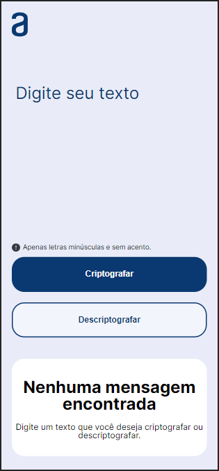
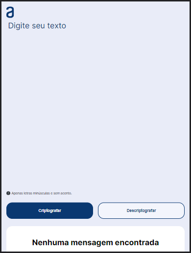
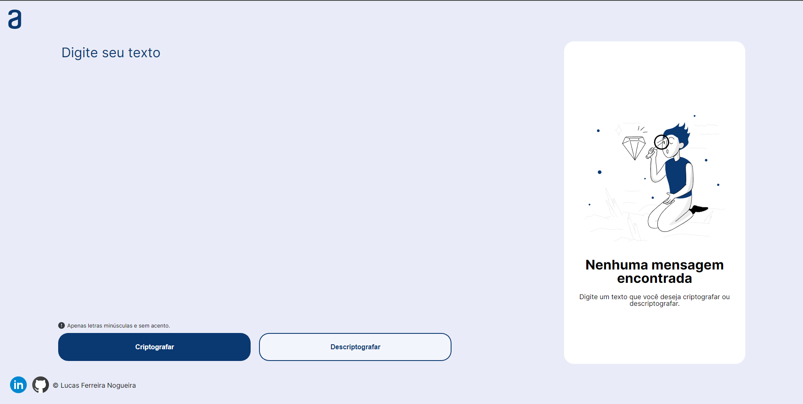

# Challenge ONE - Codificador e decodificador de texto

 

> ### Sobre
> Aplicação de criptografia de textos. Assim você poderá trocar mensagens secretas com outras pessoas que saibam o segredo da criptografia utilizada.

> ### Regras da criptografia
> As "chaves" de criptografia que utilizaremos são:
> A letra "e" é convertida para "enter"
> A letra "i" é convertida para "imes"
> A letra "a" é convertida para "ai"
> A letra "o" é convertida para "ober"
> A letra "u" é convertida para "ufat"

### Requisitos:
  - Deve funcionar apenas com letras minúsculas;
  - Não devem ser utilizados letras com acentos nem caracteres especiais;
  - Deve ser possível converter uma palavra para a versão criptografada e também retornar uma palavra criptografada para a versão original;
      - Por exemplo:
        "gato" => "gaitober"
        gaitober" => "gato"
 - A página deve ter campos para inserção do texto a ser criptografado ou descriptografado, e a pessoa usuária deve poder escolher entre as duas opções;
 - O resultado deve ser exibido na tela.

***
### **O que utilizei para desenvolver minha solução para o challeger**
  - HTML5, CSS3 e JavaScript ES6;
  - JavaScript modules;
  - formulários
    - eventos;
    - validações;
  - copy e paste para a área de transferência de texto;
  - expressões regulares;
  - responsividade (mobile, tablet e desktop)
***

 

### Overview mobile, tablet e desktop 👇🏻

